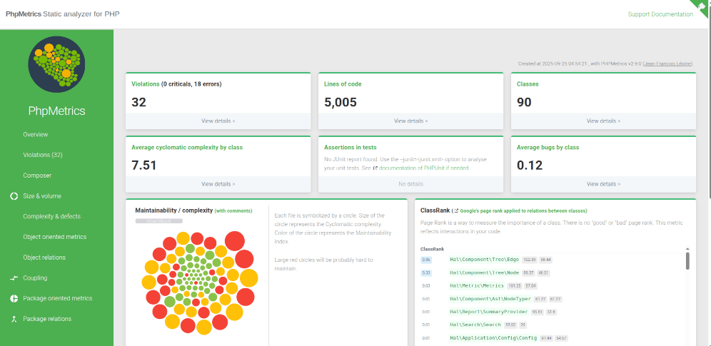

# PhpMetrics


[](https://packagist.org/packages/phpmetrics/phpmetrics)
[](https://packagist.org/packages/phpmetrics/phpmetrics)
<a href="https://github.com/sponsors/Halleck45"></a>





PhpMetrics provides metrics about PHP project and classes, with beautiful and readable HTML report. 

[Documentation](https://phpmetrics.github.io/website/) | [Twitter](https://twitter.com/Halleck45) | [Contributing](https://github.com/phpmetrics/PhpMetrics/blob/master/doc/contributing.md)

<br/><br/>


## Quick start

Follow the [quick start guide](https://phpmetrics.github.io/website/getting-started/) to get started.
```bash
# install the package as a dev dependency
composer require phpmetrics/phpmetrics --dev

# run PHPMetrics to analyze a folder and generate a report
php ./vendor/bin/phpmetrics --report-html=myreport <folder-to-analyze>
```

Then open the generated `./myreport/index.html` file in your browser. 

> You can use a [configuration file](https://phpmetrics.github.io/website/configuration/) to customize 
> the report, add options, configure rules for Continuous Integration, etc.

## Metrics

You'll find detailed list of metrics in [documentation](https://phpmetrics.github.io/website/metrics/), or 
running `php ./vendor/bin/phpmetrics --metrics`

## Author

+ Jean-François Lépine <[@Halleck45](https://twitter.com/Halleck45)>

## License

See the [LICENSE](LICENSE) file.

## Contributing

See the [CONTRIBUTING](doc/contributing.md) file.
