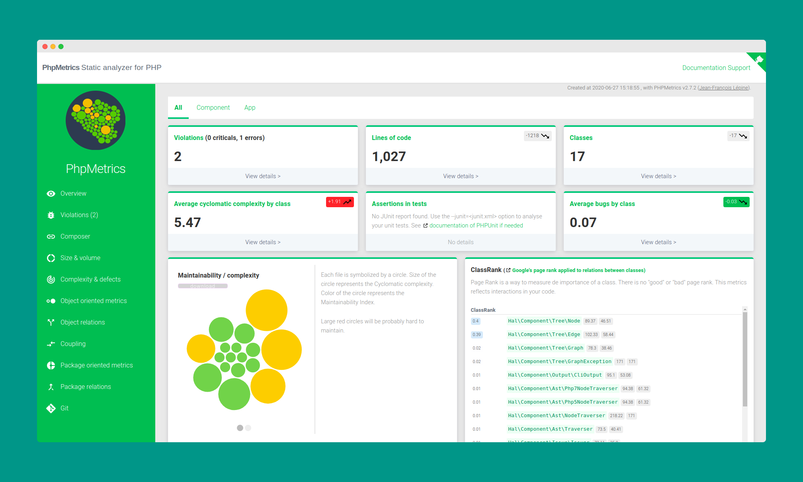
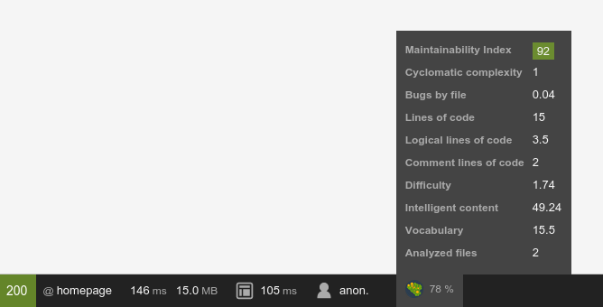

## Static analysis must be understandable

PhpMetrics analyze your PHP code and provides HTML, JSON, CSV... reports about complexity, dependencies, coupling, violations, and more !




## Quick start

    composer require phpmetrics/phpmetrics --dev
    php ./vendor/bin/phpmetrics --report-html=myreport <folder-to-analyze>
    
Then open the generated `./myreport/index.html` file in your browser. 

## Configure

Use the `--config=<file>.json` option. For example:

```js
{
    "includes": [   // directory and files to analyze, relative to config file directory 
        "src"
    ],
    "exclude": [    // regex of files (or directory) to exclude from analyze
      "tests"
    ],
    "report": {     // list of reports to generate (html, json, csv or violation)
        "html": "/tmp/report/",             // destination directory of HTML report 
        "csv": "/tmp/report.csv",           // destination file for CSV report
        "json": "/tmp/report.json",         // destination file for JSON report
        "violations": "/tmp/violations.xml" // destination file for XML violations report
    },
    "groups": [     // "layers" of code. You can group your classes and packages by regex, 
                    // to visualise specific HTML report for each of them
        {
            "name": "Component",      // name of the layer
            "match": "!component!i"   // regular expression used to match the group (based on 
                                      // the name of the fully qualified class name)
                                      // remember to double escape (for json, then for regex): 
                                      // set "!\\\\MyPackage\\\\!" if you want to capture  
                                      // expression "\MyPackage\"
        },
        {
            "name": "Example",
            "match": "!example!"
        }
    ],
    "plugins": {
        "git": {
            "binary": "git"           // if defined, runs git analyze
        },
        "junit": {
            "file": "/tmp/junit.xml"  // if defined, JUnit report file will be analyzed            
        }
    }
    "extensions": [ "php", "php8" ],        // default: ["php", "inc"]
}
```

## More

If want, you can [install](https://github.com/phpmetrics/PhpMetrics/blob/master/doc/installation.md) PhpMetrics globally with your favorite package manager (APT, Brew...). You can also visit our [documentation](http://www.phpmetrics.org/documentation/index.html).

You can integrate PhpMetrics directly [in the debug bar of your Symfony project](https://github.com/phpmetrics/PhpMetricsCollectorBundle), 
or [in PhpStorm](https://github.com/phpmetrics/PhpMetrics-jetbrains).




## Metrics list

See the [metrics](https://github.com/phpmetrics/PhpMetrics/blob/master/doc/metrics.md) file.

## Author

PhpMetrics is developed by Jean-François Lépine <[@Halleck45](https://twitter.com/Halleck45)>, with the help of 
[dozens of awesome contributors](https://github.com/phpmetrics/PhpMetrics/graphs/contributors)

## License

PhpMetrics is free and Open Source under the [MIT LICENSE](https://github.com/phpmetrics/PhpMetrics/LICENSE).